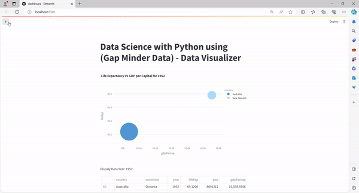
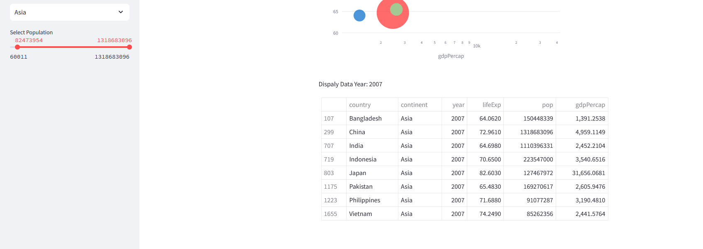

# Data Science using Python - Projects
1. <b>Project 001:<b>  
   (Data Analyzt of "Gapminder" Data which was available 1952 to 2007. This datasheet contains a wide range of indicators related to global development and analyze trends and patterns in areas such as population, life expectancy, and more.)  using Python with (Streamlit library) 

   <b>Dashboard</b>
   
   
    <b>Data Sheet</b>
   
    <b>Graph</b>
   
   
* by: Tariq Maqbool
