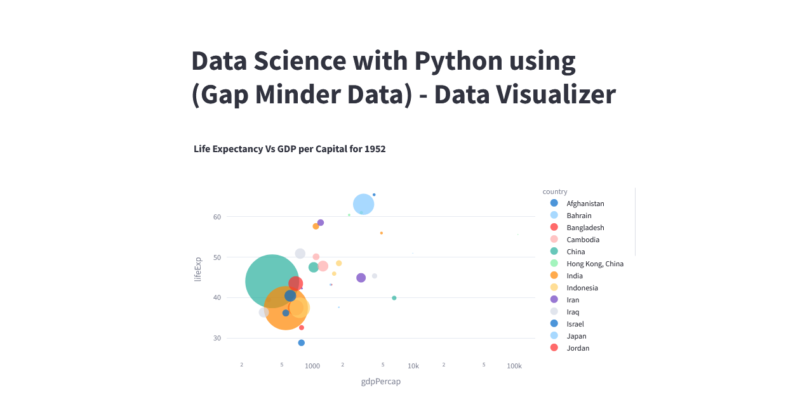
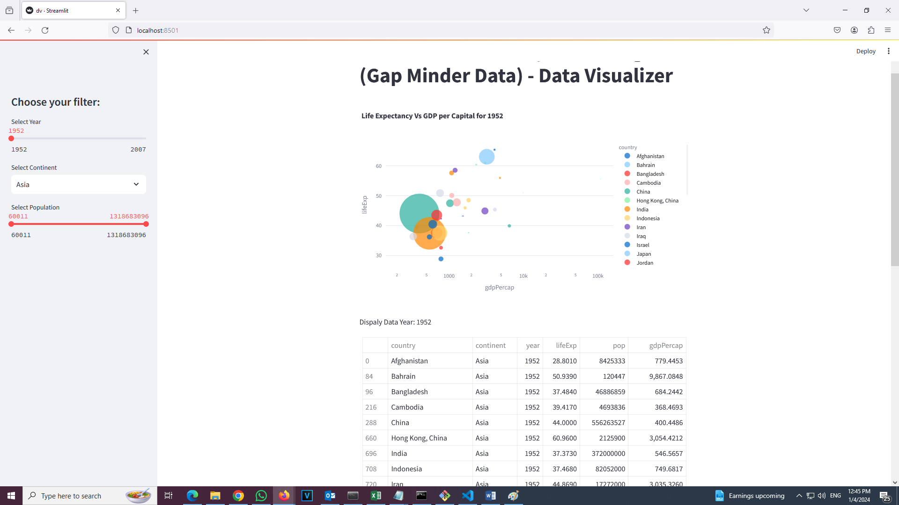
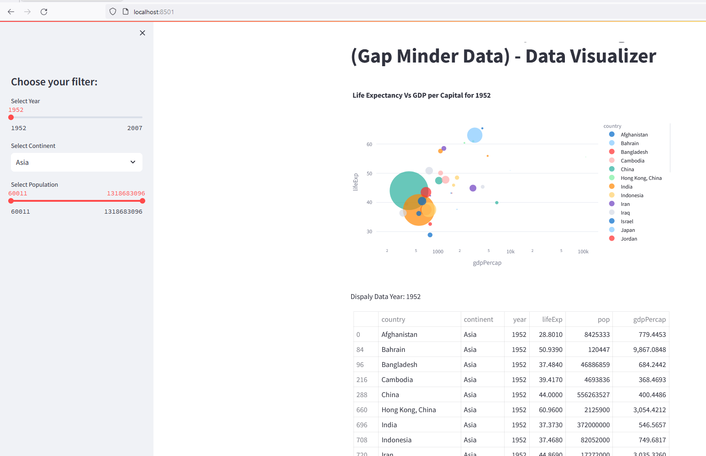

# Data Science using Python - Projects
1. Project 001: 
   (Data Analyzt of "Gapminder" Data which was available 1952 to 2007. This dataset contains a wide range of indicators related to global development and analyze trends and patterns in areas such as population, life expectancy, and more.)
   
   
   
   
* Develop by: Tariq Maqbool
