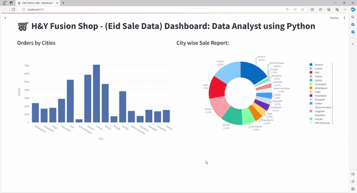

# Data Science using Python - Projects
1. <b>Project 001:<b>  
   (Data Analyzt of "Gapminder" Data which was available 1952 to 2007. This datasheet contains a wide range of indicators related to global development and analyze trends and patterns in areas such as population, life expectancy, and more.)  using Python with (Streamlit library) 

   <b>Dashboard</b> 
   

2. <b>Project 002:</b> 
This comprehensive Sales Data Analysis Report provides a detailed examination of sales performance across various key aspects, including gender, city, order, and sale amount. By dissecting these dimensions, the report aims to uncover valuable insights that can inform strategic decision-making and drive targeted business improvements. 
   <b>Dashboard</b> 
   

* by: Tariq Maqbool
